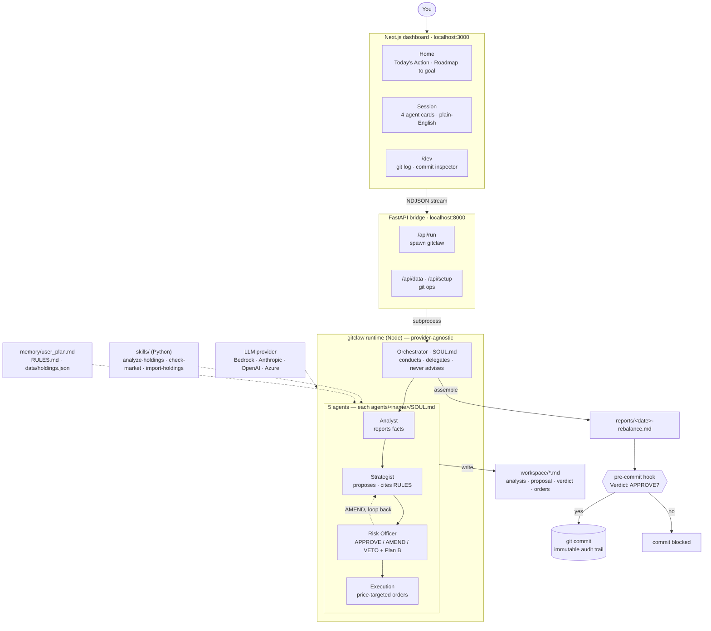

<h1 align="center">Portfolio Council</h1>

<p align="center">
  <strong>A 5-agent AI investment-research board you run as a git repo.</strong><br/>
  Every decision is a commit. Every veto is enforced by a pre-commit hook.<br/>
  You fork an advisor the same way you fork a repo.
</p>

<p align="center">
  
  
  
  
  
</p>

<p align="center">
  <a href="https://www.loom.com/share/b97de3bcb41f4fe8b703f39251481ef7">Demo video</a> &bull;
  <a href="#what-it-does">What it does</a> &bull;
  <a href="#quickstart">Quickstart</a> &bull;
  <a href="#architecture">Architecture</a> &bull;
  <a href="docs/DECISIONS.md">Decisions</a>
</p>

> Built on **[gitclaw](https://github.com/lyzr/gitclaw)** (Lyzr's GitAgent runtime) for the Lyzr AI hiring challenge: *"Build something with GitAgent that makes us go: okay… this person ships."*

> ⚠️ **Not investment advice.** Portfolio Council is an open-source research / educational tool that simulates a multi-agent governance flow. It is **not** a SEBI-registered investment adviser or research analyst. Outputs are illustrations of how the Council reasons, not personalized recommendations. **Consult a SEBI RIA before making any actual investment decision.** Past performance ≠ future results. The author accepts no liability for outcomes from following any output.

---

## What it does

You give the Onboarding agent your goals and holdings. From then on, every "should I rebalance?" question runs a **structured debate** between four specialist agents:

```
   Analyst       Strategist        Risk             Execution
   ─────────     ──────────        ─────────        ──────────
   Reports      → Proposes a   →   APPROVE  /   →   Price-targeted
   facts only;    rebalance,       AMEND    /       order list
   never            cites RULES    VETO              (no broker API)
   recommends.    

                  ↑ if AMEND, loop back to Strategist
```

The whole debate gets **committed to git** — every analysis, proposal, verdict, and execution plan is a file with a commit. Six months from now you can `git log --grep="VETOED"` and see why the AI told you to cool off.

The pre-commit hook (`hooks/pre-commit`) refuses to commit a rebalance unless `workspace/verdict-<date>.md` contains a structured `Verdict: APPROVE` marker. That's governance at the git layer — not theatre.

---

## Why agents-as-repos isn't just packaging

| Operation | Traditional AI agent | Portfolio Council (this) |
|---|---|---|
| "I want to try a more aggressive risk profile" | Edit a system prompt + restart | `git checkout -b aggressive-risk` → edit `agents/risk/SOUL.md` → run a session |
| "Why did you tell me to sell HDFC last March?" | (lost in token context) | `git log --grep="HDFC" workspace/verdict-*.md` |
| "Roll back the bad call from session 4" | Hope you saved a snapshot | `git revert <commit-sha>` |
| "Give my advisor to a friend" | Re-do the entire setup | `git clone` |
| "Block bad commits" | Trust the LLM not to lie | Pre-commit hook + structured verdict regex |

That's why **gitclaw is load-bearing** here, not decoration. Strip gitclaw and you can still ship "a multi-agent finance chatbot." Strip git and you've lost the whole audit-trail / fork-and-clone story.

---

## Quickstart

**Prerequisites:** Docker + Docker Compose, `git`, and **one** LLM provider key (Anthropic, OpenAI, AWS Bedrock, or Azure — any one).

```bash
# 1 — Clone and install the git governance hook
git clone https://github.com/RakeshMahendran/Portfolio-Council.git
cd Portfolio-Council
./scripts/setup.sh

# 2 — Create your env file (keys can stay blank — you'll set them in-app)
cp .env.example .env

# 3 — Launch (first build ~60–120s)
docker compose up

# 4 — Open the app
#     frontend → http://localhost:3000
#     backend  → http://localhost:8000
```

**First run, in the browser:**

1. The app opens **"Connect a model"** → paste a key for any provider → **Test** → **Save** (it writes `.env` for you).
2. Click **"Try with sample data"** → seeds a demo plan + `RULES.md` + holdings in ~60s.
3. Click **"Run portfolio review"** → watch the five-agent flow stream in (~12–25 min on Bedrock).

**Manage the containers:**

```bash
docker compose logs -f        # follow logs
docker compose down           # stop
docker compose up --build     # rebuild after dependency changes
```

**Run without Docker (dev mode):**

```bash
cd server && pip install -r requirements.txt && uvicorn main:app --port 8000 --reload
cd frontend && npm install && npm run dev      # separate terminal
```

> Both ports bind to `127.0.0.1` only (there's no auth on `/api/run`). Your goals and holdings stay in your clone — `memory/`, `data/`, `workspace/`, `reports/` are gitignored.

---

## Architecture

A Next.js dashboard talks to a thin FastAPI bridge, which spawns **gitclaw**. The
orchestrator delegates to five specialist agents; each writes a markdown artifact
to `workspace/`. The orchestrator assembles the final report — and a **pre-commit
hook physically blocks the commit unless the Risk Officer's verdict says APPROVE.**
The git history *is* the audit trail.



---

## What lives where

```
agents/                       five sub-agents — each is a forkable repo subtree
├── onboarding/   SOUL.md     conversational intake (one Q per turn)
├── analyst/     SOUL.md     reports facts, never recommends
├── strategist/  SOUL.md     proposes rebalances, cites RULES
├── risk/        SOUL.md     adversarial reviewer (APPROVE/AMEND/VETO)
└── execution/   SOUL.md     price-targeted order list

hooks/pre-commit              governance gate (regex-anchored APPROVE check)
SOUL.md                       orchestrator brain
RULES.md                      derived from user_plan; Risk enforces
SCOPE.md                      what's in / out of v1
docs/DECISIONS.md             11 ADRs explaining the path here
docs/applications.md          how the pattern generalizes beyond finance
examples/holdings.example.json  sanitised demo data for "Try with sample"

frontend/                     Next.js 16 App Router (Tailwind, lucide, sonner)
server/                       FastAPI + git_ops helpers
```

Per-user runtime files (`memory/`, `data/`, `workspace/`, `reports/`, `RULES.md`) are gitignored. Your goals and holdings stay in your clone.

---

## What's polished vs. what's known to drift

**Polished**
- Onboarding agent obeys SOUL.md one-question rules (rewrote it after gpt-5-mini paraphrased it — see [ADR-03](docs/DECISIONS.md))
- 4-agent debate is real: Strategist v2 proposals exist because Risk forced AMENDs
- Governance hook is installed and tests against bypass attempts
- In-chat uploads route through the `import-holdings` skill (the architecturally-pure path), not a backdoor — see [ADR-02](docs/DECISIONS.md)

**Known drift**
- Telegram skill is scoped in `SCOPE.md` but disabled in `.env.example` ("not wired up in v1"). Pick one.
- `AuthShell.tsx` is a roadmap placeholder. Documented in [ADR-05](docs/DECISIONS.md).
- Recent commit log is noisy with "Scaffold gitclaw agent" entries — agent scaffolding fires that subject by default.

**Boundaries** (explicit non-goals)
- No broker API. Execution outputs a price-targeted order list; you place the trades.
- No multi-user auth. The fork-and-clone model means each user gets their own repo. See [ADR-04](docs/DECISIONS.md).
- No paper-trading backtest. Recovery sim is a what-if calculator, not a market simulator.

---

## License & disclaimers

MIT. **Not investment advice.** The agents are wrong sometimes — that's why there's a Risk Officer, and that's why every decision is in a commit you can revert.

Built solo for the [Lyzr AI hiring challenge](https://lnkd.in/giuuNd57). Architecture decisions are documented as ADRs in [`docs/DECISIONS.md`](docs/DECISIONS.md) — including the things that broke (gpt-5-mini paraphrasing SOUL.md, regex parsing fragility, the no-banner ANSI state machine).
